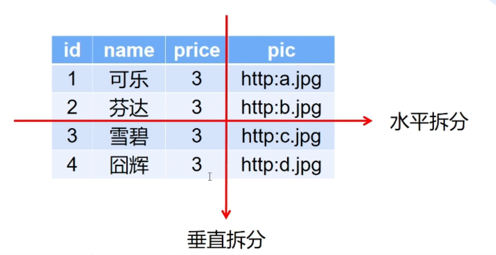
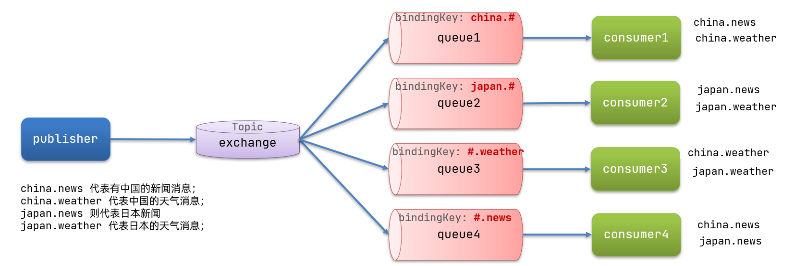

 **目录**

[1、QPS是多少？](#1、QPS是多少？)

[1.5、RT是多少，分布式锁超时时间是多少，Sentinel降级RT是多少？](#1.5、RT是多少，分布式锁超时时间是多少，Sentinel降级RT是多少？)

[2、数据量](#2、数据量)

[3、JMeter是怎么进行压测的？](#JMeter是怎么进行压测的？)

[4、高并发架构设计思路](#高并发架构设计思路)

[5、百万高并发抢券业务设计思路](#如果访问量扩大十倍，如何扩容)

[6、秒杀超卖问题](#6、秒杀超卖问题)

[7、如果访问量扩大十倍，如何扩容](#6、如果访问量扩大十倍，如何扩容)

[8、如何进行分库分表、数据迁移？](#如何进行分库分表、数据迁移？)

[9、如果将百万级别数据库里的数据进行迁移？](#如果将百万级别数据库里的数据进行迁移？)

[10、你们是怎么监控整个系统的？](#你们是怎么监控整个系统的？)

[11、日志是怎么做的？规范是什么？](#日志是怎么做的？规范是什么？)

[12、前后端分离项目怎么解决跨域问题？](#前后端分离项目怎么解决跨域问题？)

[13、给第三方提供接口，如何规避安全问题](#给第三方提供接口，如何规避安全问题)

[14、接口如何保证幂等性？](#接口如何保证幂等性？)

[15、怎么提高接口性能？](#怎么提高接口性能？)

[16、有哪些分布式ID策略？](#有哪些分布式ID策略？)

[17、Code Review是怎么做的？](#Code Review是怎么做的？)

[18、你们的开发模型是敏捷开发还是devops？](#16、你们的开发模型是敏捷开发还是devops？)

[19、什么是to B？什么是to C？](#19、什么是to B？什么是to C？)

[20、MySQL根据状态字段统计数据，状态字段会经常变](#20、MySQL根据状态字段统计数据，状态字段会经常变)

[21、哔哩哔哩在线人数是怎么统计？](#21、哔哩哔哩在线人数是怎么统计？)

[22、6升和5升杯子，量出3升水](#22、6升和5升杯子，量出3升水)

[23、设计一个定时任务](#23、设计一个定时任务)

[24、从网上下载东西，然后解析存到数据库的线程模型怎么设计](#24、从网上下载东西，然后解析存到数据库的线程模型怎么设计)

------


## 1、QPS是多少？

> tp99：99%的请求耗时在100ms以内。
>
> 并发数=qps*rt。例如qps1000，平均响应时间是0.1s，则并发数100
>
> qps：每秒请求数
>
> rt：请求的响应时间，单位s
>
> tps：每秒事务数

- **MySQL瓶颈：**单个 MySQL 的每秒写入在 4000 QPS 左右，超过这个数字，MySQL 的 I/O 时延会剧量增长。
- **Redis瓶颈：**Redis 单分片的写入瓶颈在 2w 左右，读瓶颈在 10w 左右；官方给出的报告综合8w左右。
- **Nginx：**单机QPS瓶颈30w。一般不会成为系统瓶颈。**并发连接数：**官方测试支持5万并发连接。实际生产环境能到2-3万并发连接数。淘宝tengine团队说测试结果是“24G内存机器上，处理并发请求可达200万”。
- **RabbitMQ：**单机QPS在万级别。
- **Tomcat：**单机QPS瓶颈三四千。**并发连接数：**默认最大并发数是150，瓶颈一般是300-400并发数。

平时QPS只有三四百，早上7-9点高峰期能到八百，双十一等最高峰期qps到一千五六。加了sentinel限流。

Redis主从3台服务器、MySQL主从3台服务器，客诉单、申诉单、催收单服务各3台Tomcat服务器，RabbitMQ是1台服务器，sentinel是1台服务器。

## 1.5、RT是多少，分布式锁超时时间是多少，Sentinel降级RT是多少？

**RT：**

- 100ms为优良
- 500ms为及格
- 1000ms以上为不可忍受

**客诉单提交接口RT大概400ms左右。**

分布式锁超时时间：5s（考虑RT）。

**降级规则：**RT 10s，时间窗口30s。即RT超过10s时，接下来这个方法将在接下来的30s时间窗口里保持熔断。

编辑

> **流控规则：**QPS最大3000，warm up
>
> 编辑

## 2、数据量

- 客诉单：700w
- 记录表：每张表300w，11张表一共3000w，通过hash切分进行分表。
- 催收单：100w
- 申诉单：100w

## 3、JMeter是怎么进行压测的？

1. 添加线程组，设置线程数、循环次数；
2. 添加请求路径、协议、参数；
3. 查看结果树：每个请求路径、方式、响应结果
4. 查看汇总报告：请求数、TP99（90%请求在多少ms内完成）、TP95、响应时间中位数

实际的使用资源，一般是压测数据的 1.5 倍，我们需要保证线上有部分资源冗余以应对突发的流量增长。

## 4、高并发架构设计思路

画架构图，核心思想是分而治之，具体方法是缓存和消息。

- **需求拆解：**思考有哪些表；我们需要有客诉单表、记录表、催收单表、申诉单表等表；

- **QPS分析：**平时并发只有八九十，早上高峰期，7-9点高并发，qps到**三四百**。双十一等场景QPS最高能到一千左右，加了sentinel限流。

- **数据库（考虑瓶颈）：**因为客诉单等信息需要持久化，所以选用常用关系型数据库MySQL。MySQL单机瓶颈4000 QPS，一主二从加上各种优化的话能应付系统六千QPS，但是双十一等高峰期就顶不住了需要sentinel限流。

- **表、索引设计：**单表数据量到达千万级就会极大程度影响查询效率，要考虑水平拆分。

- 缓存（考虑瓶颈）：

  Redis缓存客诉单、投诉类型等信息。Redis单分片写瓶颈2w，读瓶颈10w，一主二从的话应付系统五六千的请求绰绰有余。 

  - **缓存和数据库一致性：**延时双删方案、异步监听+可靠消息删除方案
  - **本地缓存：**引入本地缓存可以降低Redis压力，减少Redis超时请求的比例；需要注意，引入本地缓存后需要定时任务将最新的数据刷新到本地缓存

- **消息队列：**因为会用到延时队列，所以选用RabbitMQ，一方面异步提高性能，例如落库后发消息同步es；另一方面被投诉方三天还不处理会被客服受理强制执行，所以需要延时队列。

- **负载均衡：**用Nginx负载均衡，Nginx单机瓶颈50w QPS，不会成为系统瓶颈。

- **系统框架选择：**Springboot+Nacos+OpenFeign+Sentinel+RabbitMQ+MySQL+Redis。

- **考虑安全和性能问题：**考虑超额扣减库存、参数校验、权限校验、重复发券校验、线程安全、事务粒度和回滚方案、幂等性、性能瓶颈、MySQL,Redis,JVM调优、优惠券过期时间设置和到期自动删除。要尽量把不耗时的业务放前面来抵挡大部分请求。

- **设计业务流程：**冻结运单、生成模板、举证文字、图片、落库客诉单表、MQ落库ES、落库记录表、外呼表。提交客诉单时幂等性检测用户id，保证只提交一个客诉单。

- 服务治理：

  - **监控与报警。**对于一些核心接口的监控、稳定性、重要数据，以及系统 CPU、内存等的监控，我们会在 Grafana 上建立对应的可视化图表，在春节活动期间，实时观测 Grafana 仪表盘，以保证能够最快观测到系统异常。同时，对于一些异常情况，我们还有完善的报警机制，从而能够第一时间感知到系统的异常。
  - **资源隔离。**因为我们服务都是部署在 docker 集群中的，因此为了保证服务的高可用，服务部署的集群资源尽量分布在不同的物理区域上，以避免由集群导致的服务不可用。
  - sentinel解决服务雪崩问题：
    - **限流。**实际业务场景下，客诉单服务会被一些上游服务（例如客服服务）所调用，因此，合理的对这些上游服务进行限流，也是保证优惠券系统本身稳定性必不可少的一环。
    - **线程隔离：**调用者在调用服务提供者时，给每个调用的请求分配独立线程池，出现故障时，最多消耗这个线程池内资源，避免把调用者的所有资源耗尽。
    - **熔断降级：**调用方加入断路器，统计对服务提供者的调用，如果调用失败比例过高，则熔断该业务，不允许访问该服务提供者。熔断后降级访问备胎方法。例如有些网站做的不好，直接服务雪崩完全崩溃，例如知乎。有些网站就可用性高，崩溃时常常是你无法评论、没法下单、没法联系客服、没法投诉，但是正常页面的浏览和视频播放是可以的，例如哔哩哔哩，这就保证了高可用。
    - **超时设置：**超过500ms的请求拒绝。

- 压测：

  - 找到 MySQL 一主的写瓶颈、读瓶颈
  - 找到 Redis 单分片写瓶颈、读瓶颈
  - 实际的使用资源，一般是压测数据的 1.5 倍，我们需要保证线上有部分资源冗余以应对突发的流量增长。

- **效果：**系统在高峰期6w QPS 的请求下，请求成功率达到 99.9%以上，系统监控正常。双十一期间，该客诉服务承载了庞大流量，期间未出现异常，圆满完成高并发场景下的物流调度客诉任务。


## 5、百万高并发抢券业务设计思路

1. 需求拆解（思考需要哪些表）
2. 存储方案：数据库、Redis、本地
3. 选择服务器数量：根据QPS和数据库缓存库Tomcat瓶颈选择服务器数量
4. 选择缓存一致性方案
5. MQ异步解耦
6. 考虑性能和安全问题：考虑超额扣减库存、参数校验、权限校验、重复发券校验、线程安全、事务粒度和回滚方案、性能瓶颈、MySQL,Redis,JVM调优、优惠券过期时间设置和到期自动删除。要尽量把不耗时的业务放前面来抵挡大部分请求。
7. 设计业务流程： 
   1. 库存刷缓存：活动发布之前把数据库里优惠券库存数量都刷入Redis里，别等到秒杀时候再刷缓存，降低数据库压力。数据库单机写瓶颈4000 QPS，Redis单机写瓶颈2w QPS。
   2. 定时任务发券：防止重复发券、保证顺序性防止超发。
   3. 业务校验：
   4. 扣减优惠券数量：
   5. 发MQ记录表落库：知道给哪些用户、什么时间发券了。
8. 监控报警；
9. 服务治理：Sentinel限流、熔断降级、超时时间设置。

## 6、秒杀超卖问题

超卖问题：两个线程同时获取到库存为1，都扣一次库存，导致库存被扣到-1。超卖问题归根结底是扣减操作没有保证原子性。原子性就是说一个线程只能获取到库存扣减前或扣减后的库存值，不能获取扣减中的库存值。

解决办法：分布式锁（乐观锁、Redis）保证库存增减的原子性。

悲观锁方案：不建议，性能差。


## 7、如果访问量扩大十倍，如何扩容

网关直接多部署 10 倍的机器即可，前面的 Nginx 做会负载均衡，把流量均分发给各个网关机器

数据库横向扩容很麻烦，可以考虑给单个数据库部署的机器提高配置，32核 128G 高配物理机，每秒钟抗几千请求问题不大


## 8、如何进行分库分表、数据迁移？

**概念：**

- 只分表：单表数据量大，读写出现瓶颈，这个表所在的库还可以支撑未来几年的增长。
- 只分库：整个数据库读写出现性能瓶颈，将整个库拆开。
- 分库分表：单表数据量大，所在库也出现性能瓶颈，就要既分库又分表。
- 垂直拆分：把字段分开。例如spu表的pic字段特别长，建议把这个pic字段拆到另一个表（同库或不同库）。
- 水平拆分：把记录分开。例如表数据量到达百万，我们拆成四张20万的表。

编辑

 **拆分原则：**


| 数据量增长情况                             | 数据表类型 | 优化核心思想                     |
| ------------------------------------------ | ---------- | -------------------------------- |
| 数据量为千万级，是一个相对**稳定**的数据量 | 状态表     | 能不拆就不拆读需求水平扩展       |
| 数据量为千万级，可能达到**亿级**或者更高   | 流水表     | 业务拆分，面向分布式存储设计     |
| 数据量为千万级，可能达到**亿级**或者更高   | 流水表     | 设计数据统计需求存储的分布式扩展 |
| 数据量为千万级，不应该有这么多的数据       | 配置表     | 小而简，避免大一统               |

**分库分表步骤：**

- **MySQL调优：**数据量能稳定在千万级，近几年不会到达亿级，其实是不用着急拆的，先尝试MySQL调优，优化读写性能。
- **目标评估：**评估拆几个库、表，举例: 当前20亿，5年后评估为100亿。分几个表? 分几个库?解答:一个合理的答案，1024个表，16个库按1024个表算，拆分完单表200万，5年后为1000万.1024个表*200w≈100亿
- **表拆分：**
  - **业务层拆分：**混合业务拆分为独立业务、冷热分离
  - **数据层拆分：**
    - **按日期拆分：**这种使用方式比较普遍，尤其是按照日期维度的拆分，其实在程序层面的改动很小，但是扩展性方面的收益很大。
      - 日维度拆分，如test_20191021
      - 月维度拆分,如test_201910
      - 年维度拆分,如test_2019
    - **按主键范围拆分：**例如【1,200w】主键在一个表，【200w，400w】主键在一个表。优点是单表数据量可控。缺点是流量无法分摊，写操作集中在最后面的表。
    - **中间表映射：**表随意拆分，引入中间表记录查询的字段值，以及它对应的数据在哪个表里。优点是灵活。确定是引入中间表让流程变复杂。
    - **hash切分：**sharding_key%N。优点是数据分片均匀，流量分摊。缺点是扩容需要迁移数据，跨节点查询问题。
    - **按分区拆分：**hash,range等方式。不建议，因为数据其实难以实现水平扩展。
- **sharding_key（分表字段）选择：**尽量选择查询频率最高的字段，然后根据表拆分方式选择字段。
- **代码改造：**修改代码里的查询、更新语句，以便让其适应分库分表后的情况。
- **数据迁移：**最简单的就是停机迁移，复杂点的就是不停机迁移，要考虑增量同步和全量同步的问题。
  - **增量同步：**老库迁移到新库期间，新增删改命令的落库不能出错
    - 同步双写：同步写新库和老库；
    - **异步双写（推荐）：** 写老库，监听binlog异步同步到新库
    - 中间件同步工具：通过一定的规则将数据同步到目标库表
  - **全量同步：**老库到新库的数据迁移，要控制好迁移效率，解决增量数据的一致性。
    - **定时任务查老库写新库**
    - 使用中间件迁移数据
- **数据一致性校验和补偿：**假设采用异步双写方案，在迁移完成后，逐条对比新老库数据，一致则跳过，**不一致则补偿：**
  - 新库存在，老库不存在：新库删除数据
  - 新库不存在，老库存在：新库插入数据
  - 新库存在、老库存在：比较所有字段，不一致则将新库更新为老库数据
- **灰度切读：**灰度发布指黑（旧版本）与白（新版本）之间，让一些用户继续用旧版本，一些用户开始用新版本，如果用户对新版本没什么意见，就逐步把所有用户迁移到新版本，实现平滑过渡发布。**原则：**
  - 有问题及时切回老库
  - 灰度放量先慢后快，每次放量观察一段时间
  - 支持灵活的规则：门店维度灰度、百 (万)分比灰度
- **停老用新：**下线老库，用新库读写。


## 9、如果将百万级别数据库里的数据进行迁移？

- **数据迁移：**最简单的就是停机迁移，复杂点的就是不停机迁移，要考虑增量同步和全量同步的问题。
  - **增量同步：**老库迁移到新库期间，新增删改命令的落库不能出错
    - 同步双写：同步写新库和老库；
    - **异步双写（推荐）：** 写老库，监听binlog异步同步到新库
    - 中间件同步工具：通过一定的规则将数据同步到目标库表
  - **全量同步：**老库到新库的数据迁移，要控制好迁移效率，解决增量数据的一致性。
    - **定时任务查老库写新库**
    - 使用中间件迁移数据
- **数据一致性校验和补偿：**假设采用异步双写方案，在迁移完成后，逐条对比新老库数据，一致则跳过，**不一致则补偿：**
  - 新库存在，老库不存在：新库删除数据
  - 新库不存在，老库存在：新库插入数据
  - 新库存在、老库存在：比较所有字段，不一致则将新库更新为老库数据
- **灰度切读：**灰度发布指黑（旧版本）与白（新版本）之间，让一些用户继续用旧版本，一些用户开始用新版本，如果用户对新版本没什么意见，就逐步把所有用户迁移到新版本，实现平滑过渡发布。**原则：**
  - 有问题及时切回老库
  - 灰度放量先慢后快，每次放量观察一段时间
  - 支持灵活的规则：门店维度灰度、百 (万)分比灰度
- **停老用新：**下线老库，用新库读写。

## 10、你们是怎么监控整个系统的？

普罗米修斯+Grafana，监控springboot的QPS等、监控MySQL、Redis、监控jvm。普罗米修斯监控得到的数据是文本形式；Grafana是可视化工具，对普罗米修斯的数据进行展示统计报警。

**普罗米修斯安装步骤：**

1. 普罗米修斯官网下载解压；配置ip和端口；
2. 启动，发现默认只监控自己这台节点（Endpoint）；
3. 下载解压配置exporter：官网下载解压Linux、MySQL等组件的exporter，分别配置ip和端口，然后这些exporter会暴露出url为http://ip:host/metrics的http服务，普罗米修斯就可以对它进行监控。
4. 启动，发现可以看见很多远程服务器节点（Endpoint），运行状态；
5. 点击这些节点可以查看监控的所有指标

 编辑

编辑

**Grafana安装：**

1. 下载安装解压启动，配置端口域名用户名密码；
2. 网页添加普罗米修斯数据源，输入url；
3. 导入MySQL、JVM等仪表盘


## 11、日志是怎么做的？规范是什么？

**Log4j：**是一个完整的**日志库**。需要导入log4j依赖，在yml配置输出到控制台的输出格式（日期、日志级别（info,error,warn,debug,trace）、全限定类名、内容、回车）等信息，配置输出到文件的存储路径、文件名、日期格式等信息。可以通过Log4j的配置文件灵活配置日志的记录格式、记录级别、输出格式等，而不需要修改已有的日志记录代码。

**Slf4j：**是日志库的**统一规范接口**。需要导入lombok依赖。接口用来统一打印日志，忽略日志的具体实现方法，即使我们的系统换了一个日志源，不需要我们去更改代码。

**日志规范：**

- **日志级别：**选择恰当的日志级别；error（严重错误，对业务影响大）、warn（对业务影响不大，主要给开发看）、info（关键参数、调用时间）、debug（关键逻辑里面的运行时数据）、trace（最详细信息，只记录在文件不打印在控制台）

- **入参出参：**要打印方法的入参、出参

- **日志格式：**选择合适的日志格式，时间精确到ms，日志级别、线程名、类名

- **分支首行：**分支首行打印日志；

- **低日志级别要开关判断：**trace/debug前要log.isDebugEnabled()、log.isTraceEnabled()

- **SLF4J：**不能直接使用日志系统（Log4j、Logback）中的 API，而是使用日志框架SLF4J中的API。

- **不要拼接：**建议使用参数占位{}，而不是用+拼接。因为字符串拼接有一定的性能损耗。

- **配置开启异步：**日志最终会输出到文件或者其它输出流中的，IO性能会有要求的。如果异步，就可以显著提升IO性能。

- 不要使用e.printStackTrace()：

  改成log.error("你的程序有异常啦",e); 

  - **防止日志混乱：**e.printStackTrace()打印出的堆栈日志跟业务代码日志是交错混合在一起的，通常排查异常日志不太方便。
  - **性能问题：**printStackTrace()方法会生成大量的字符串对象，对系统性能有一定的影响。

- **异常要输出整个e：**log.error('你的程序有异常啦', e);而不是e.getMessage()

- **不要同时抛异常和打印异常：**会导致栈信息打印两次。

- **不同类型日志文件分离：**根据业务模块分离日志、根据日志级别分离日志。

- **日志尽可能完整但不要重复：**有利于排查定位问题。

## 12、前后端分离项目怎么解决跨域问题？

**跨域：**指的是浏览器不能执行其他网站的脚本，它是由浏览器的同源策略造成的，是浏览器对javascript施加的安全限制。

**同源策略：**是指协议，域名，端口都要相同，其中有一个不同都会产生跨域问题。

**解决跨域：**nginx反向代理为同一域、@CrossOrigin、CorsWebFilter

- **Nginx：**生产环境下，使用nginx反向代理为同一域。使用Nginx反向代理，不同地址、端口都被同一个域名反向代理了，这就是同一域了。这种方法在开发时没法用。
- **@CrossOrigin：**在支持跨域的方法上添加@CrossOrigin注解。
- **CorsWebFilter：**网关模块新建配置类，将CorsWebFilter注册为Bean，Bean内部新建CorsConfiguration对象，设置允许跨域的请求头、请求方式、url、是否允许携带cookie等信息，然后将CorsConfiguration对象作为CorsWebFilter对象的参数返回。CORS是跨域资源共享，用于解决后端跨域问题。
- **网关全局跨域：**spring.cloud.gateway.routes.globalcors.corsConfigurations配置允许跨域的请求头、请求方式、url、是否允许携带cookie等信息

```java
@Configuration
public class CorsConfiguration{
 
    @Bean
    public CorsWebFilter corsWebFilter(){
        UrlBasedCorsConfigurationSource source = new UrlBasedCorsConfigurationSource();
 
        CorsConfiguration corsConfiguration= new CorsConfiguration();
        //1、配置跨域
        // 允许跨域的请求头
        corsConfiguration.addAllowedHeader("*");
        // 允许跨域的请求方式
        corsConfiguration.addAllowedMethod("*");
        // 允许跨域的请求来源
        corsConfiguration.addAllowedOriginPattern("*");
//注释的这句会报错。因为当allowCredentials为真时，allowedorigin不能包含特殊值"*"，因为不能在"访问-控制-起源“响应头中设置该值。
        //corsConfiguration.addAllowedOrigin("*");//这句会报错
        // 是否允许携带cookie跨域
        corsConfiguration.setAllowCredentials(true);
 
        // 任意url都要进行跨域配置，两个*号就是可以匹配包含0到多个/的路径
        source.registerCorsConfiguration("/**",corsConfiguration);
        return new CorsWebFilter(source);
 
    }
}
```


## 13、给第三方提供接口，如何规避安全问题

- **数据脱敏掩码：**手机号、身份证号、密码等敏感信息要用md5或bcrypt进行掩码，虽然只有开发和运维会看到日志，但还是需要防一下。
- **参数校验：**JSR303校验，实体类注解@NotNull(message,groups)等，接口参数注解@Valid或@Validated({AddGroup.class})
- **接口幂等性：**数据库唯一约束、乐观锁、Redis唯一序列号。
- **数据加密：**日常数据传输使用https就够了，如果安全性要求高，例如要需要传输密码，密码使用rsa非对称加密。rsa：导入依赖后，创建两个RSA对象，构造参数分别是公钥和私钥，公钥RSA进行加密，私钥RSA解密。
- **时间戳超时机制：**用户每次请求都带上当前时间的时间戳timestamp，服务端接收到timestamp后，解密、验签通过后，与服务器当前时间进行比对，如果时间差大于一定时间(比如3分钟)，则认为该请求无效。防止恶意请求，不断发请求搞垮你的系统。
- **限流：**例如sentinel限流。
- **黑名单机制、白名单机制**

> 对称加密：加密解密使用同一把密钥，优点是速度快，常见算法des和aes。
>
> 非对称加密：加密时采用公钥，解密时采用私钥。公钥私钥成对存在，公钥加密后只有对应的私钥才能解密，私钥加密后只有对应的公钥才能解密。常见算法rsa。缺点是性能开销。

## 14、接口如何保证幂等性？

同时发多次请求，结果一样，也就是说只有一个请求会成功。

- **前端防抖处理：**防止用户告诉点击提交按钮导致订单重复提交。解决办法：前端对这个点击事件进行处理，控制在100ms内同一用户只有第一次点击提交按钮会提交成功。前端治标不治本，例如一些恶意重复提交的情况，一般会用程序避开前端的页面控制，比如说用爬虫程序，这就需要后端来限制接口重复提交，构建第二道防线。
- **数据库约束：**比如唯一约束，主键。同一个主键不可能两次都插入成功。不推荐因为适用范围太窄，只适用于保存数据库前就已经设置好主键并且每次主键一样的情况下。缺点是只适用于新增场景。
- **乐观锁：**数据库表中增加一个版本字段，更新时判断是否等于某个版本。例如重复提交时判断数据库发现版本已被改变就不提交了。不推荐，因为要查数据库，给数据库压力，临时的操作我们尽量在缓存库里操作，降低数据库压力。
- **Redis存唯一序列号（推荐）：**点击“进入订单”时就生成随机uuid作为token，存Redis"业务前缀+用户id"--->token，携带token发“提交订单”请求，提交订单方法原子性验删前端传来的token和Redis根据查的token。验证删除成功后才正式执行提交业务，验证失败代表完全不是一个订单，删除失败代表有其他同订单线程已经验删成功了。
- **验证码：**让用户每次提交时输入验证码，提交后校验前后端验证码实现幂等性。

## 15、怎么提高接口性能？

- **通用：**Redis缓存、MQ、MySQL调优、多线程、硬件（网络带宽、加内存）
- **本地缓存：**如果不是强一致的话，可以尝试加本地缓存（例如Spring的caffeine）。因为本地缓存加在服务器上，不同服务器更新频率不同可能导致本地缓存的数据不一致，所以只适用于对一致性要求不高的场景。
- **Nginx开启gzip：**压缩JSON文件，提高传输效率，传输到浏览器后再进行解压。Nginx默认不开启，要手动修改配置文件开启，并设置文件超过多大时压缩、压缩哪些文件类型。
- 传输类瘦身：
  - 去除冗余字段，只查需要用到的字段。
  - 通过@JsonProperty给vo属性名重命名为一个字符或两个字符大小。

## 16、有哪些分布式ID策略？

**自增策略的缺点：**

- **自增ID回溯**：存在自增ID回溯的问题，可靠性不高，这个问题直到最新版本的MySQL 8.0才修复。自增ID回溯：生成id前执行 last_insert_id() 函数获取上一条记录的id为x，如果删除上一条记录并重启MySQL，再次执行函数得到的id是x-1，产生回溯了。
- **安全性不高**：对外暴露的接口可以非常**容易猜测对应的信息**。比如：/User/1/这样的接口，可以非常容易猜测用户ID的 值为多少，总用户数量有多少，也可以非常容易地通过接口进行数据的爬取。
- **性能差**：自增ID的性能较差，需要在数据库服务器端生成。
- **需要额外执行函数得知自增值，高并发时锁竞争影响性能**：业务还需要额外执行一次类似 **last_insert_id()** 的函数才能知道刚才插入的自增值，这需要多一次的 网络交互。在海量并发的系统中，多1条SQL，就多一次性能上的开销。而且在高并发场景下锁竞争获取自增值会极大的影响性能，即使它是原子性的。
- **分库分表、数据迁移时，自增不再适用。**

**UUID：**分布式唯一，缺点是不有序。

【时间低位-时间中位-时间高位-UUID版本-时钟序列-MAC地址】。

MySQL8.0开始支持有序UUID，可以通过uuid_to_bin函数实现。原理是将时间低位和时间高位的顺序更换。

**雪花算法（建议）：**分布式id算法，有序。与系统时间有关，如果修改了系统时间会导致主键重复。

【代表正数的固定值0-时间戳-机器ID-服务ID-序号】

## 17、Code Review是怎么做的？

每个迭代会和整个团队开一次代码审查会议。我们坐在会议室，每一个开发者展示并解释着他最近写的一段困难的代码。其他开发者尝试寻找着潜在的缺陷，发表评论，给出如何改进代码的建议。我感觉这种做法适用于的一种情况：当整个团队都没有代码审查的经验时，让把每个人聚起来，一起做代码审查，这样弄几次之后，可能会帮助每个人理解代码审查的目标和意义。

> **其他Code Review方法：**
>
> - **pull request：**项目的每一个版本开发需要建对应的一个版本号例如：v1.0.0 ，然后每个人需要基于这个分支建自己的小分支例如：v1.0.0_name1 ，这样的话你就可以在v1.0.0_name1分支上开发了，当想把自己分支的代码提交到当前项目的分支v1.0.0 中的时候，就可以用 Pull Request 来提交，然后code review的管理者就可以看到有 pull request请求，然后管理者可以查看提交的内容，可以评论，和通过。当管理者通过后，你的提交就自动进入了v1.0.0分支里面了。
> - **瞬时的代码审查：**也称为结对编程(pair programming)。 发生在结对编程的情景中。当一个开发者在敲键盘写代码的同时，另一个开发者盯着代码，注意着代码中潜在的问题，并在此过程中给出提升代码质量的建议。结对编程适用于两个有相似经验水平的开发者处理复杂的业务问题的情况。
> - **同步的代码审查：**也称为即时(over-the-shoulder)代码审查 一个开发者独自编写代码，当她写完代码后，立即找代码审查者进行审查。审查者来到开发者的桌前，看着同一块屏幕，一起审查、讨论和改进代码。当审查者不清楚这个任务的目标时，这种代码审查类型会很有效果。
> - **异步的代码审查：**也称为有工具支持的(tool-assisted)代码审查 开发者在写完代码后，让这些代码对审查者可见，然后开始她的下一个任务。当审查者有时间了，他会在自己的桌子上按自己的时间表进行代码审查。他而不需要当面和开发者沟通，而是用工具写一些评论。在完成审查后，那些工具会把评论和需要的改动通知给开发者。开发者就会根据评论改进代码。异步的代码审查应该作为每一个专业开发团队的默认选项。
> - **迭代会议审查：**每个迭代会和整个团队开一次代码审查会议。我们坐在会议室，每一个开发者展示并解释着他最近写的一段困难的代码。其他开发者尝试寻找着潜在的缺陷，发表评论，给出如何改进代码的建议。我感觉这种做法适用于的一种情况：当整个团队都没有代码审查的经验时，让把每个人聚起来，一起做代码审查，这样弄几次之后，可能会帮助每个人理解代码审查的目标和意义。

## 18、你们的开发模型是敏捷开发还是devops？

**瀑布模型：**期望整个系统从开始到结束都是一个整体，所有的周期活动只进行一次。也就是只做一次需求获取(一次就获取到所有的需求)，一次需求分析(一次将所有的需求分析完整)，一次设计等等。**流程：**

- **需求设计：**大概花了六个月吧，首先是产品和项目经历对接甲方确定需求文档，大概一周时间；半个月；
- **概要设计：**然后我们后端小组立项、分析功能模块、编写概要设计文档，包括模块名、子功能、每个增删改查接口，设计表；半个月；
- **详细设计：**各功能的接口，包括请求路径、请求参数、响应值等；半个月；
- **编码阶段：**架构师搭建工程、选择技术、我们根据各自负责模块开发，每半个月为一个小周期完成需求；三个月；
- **全链路测试：**半个月；
- **预交付：**跟甲方拉扯需求，一般是前端修改；半个月；

增量模型：增量模型将整个系统结构化的拆成几个增量（功能模块）-- 比如3个，每一个完整的周期完成一个增量，有几个增量就重复几个周期。

**迭代开发模型：**在迭代开发中，将系统的开发工作划分成一个个迭代，不要求一次行完成整个系统的开发（相对于瀑布开发而言）。迭代开发目前有两种，一种是在**每个迭代中使用瀑布模型**。另一种是每一个迭代中完成软件开发阶段的某一个阶段。

敏捷开发：如果只是从开发的核心阶段来看，敏捷开发就是迭代开发。然而实际上迭代开发是敏捷开发的一部分，指导开发阶段的那一部分。敏捷开发还包括了迭代开发不包含的：开卡、结卡、TDD、Pair programming、review、feedback等等实践活动。敏捷开发在迭代开发的基础上，通过引入一些活动来达到团队自循环、自我完善，从而对团队本身进行迭代，以提高团队的开发效率、质量、体验等。

## 19、什么是to B？什么是to C？

- to B：为企业提供服务。例如员工管理系统是给企业用的、淘宝商家版是给商家用的。
- to C：为消费者提供服务。例如淘宝给用户卖商品、抖音给用户卖流量

## 20、MySQL根据状态字段统计数据，状态字段会经常变

## 20.1、哔哩哔哩播放量怎么统计？

**哔哩哔哩方案：**用户同时点击两个窗口，只算一次观看：Redis的set类型，将每个观看用户的ip地址加到set里。然后定时任务每隔1小时把数据刷到数据库里。这个应该也是哔哩哔哩的大致方案，他们只考虑播放量，而不考虑平均播放时长，导致垃圾营销号的视频播放量都很高。

**视频播放时长记次方案：**每次播放时都新增一个延时队列，ttl是视频的51%时间，到时间检查一下用户是否还在观看（可以查用户同一ip浏览记录）。


## 21、哔哩哔哩在线人数是怎么统计？

这个数据经常变，而且不敏感，不建议直接数据库字段统计。

用户同时点击两个窗口，只算一次观看：Redis的set类型，将每个观看用户的ip地址加到set里，并设置视频时长为过期时间。然后定时任务每隔1小时把数据刷到数据库里。设置1小时主要考虑到这个数据不敏感。

用户同时点击两个窗口，算两次观看：不太建议，有刷单的风险，刷单的视频比真正有质量的视频在线人数高，得到更多推广。而且在线人数多上了热门，而不是付费上热门，刷单成本比付费成本低，所以不建议。

## 22、6升和5升杯子，量出3升水

记A为5升杯子，B为6升杯子。核心是要取到B里4升。

1. A满，倒入B。此时A0，B5
2. A满，倒入B。此时A4，B6
3. 倒掉B，A倒入B。此时A0，B4
4. A满，倒入B。此时A3，B2

## 23、设计一个定时任务

## 24、从网上下载东西，然后解析存到数据库的线程模型怎么设计

多线程下载解析，然后countdownlatch或者CompletableFuture的allOf()后对数据进行整合，存储

## 25、待添加

1、情景题：如果一个外卖配送单子要发布，现在有200个骑手都想要接这一单，如何保证只有一个骑手接到单子？
 2、场景题：美团首页每天会从10000个商家里面推荐50个商家置顶，每个商家有一个权值，你如何来推荐？第二天怎么更新推荐的商家？
 可以借鉴下stackoverflow，视频网站等等的推荐算法。
 3、场景题：微信抢红包问题
 悲观锁，乐观锁，存储过程放在mysql数据库中。
 4、场景题：1000个任务，分给10个人做，你怎么分配，先在纸上写个最简单的版本，然后优化。
 全局队列，把1000任务放在一个队列里面，然后每个人都是取，完成任务。
 分为10个队列，每个人分别到自己对应的队列中去取务。
 5、场景题：保证发送消息的有序性，消息处理的有序性。
 6、如何把一个文件快速下发到100w个服务器
 7、给每个组分配不同的IP段，怎么设计一种结构使的快速得知IP是哪个组的?
 8、10亿个数，找出最大的10个。
 建议一个大小为10的小根堆。
 9、有几台机器存储着几亿淘宝搜索日志，你只有一台2g的电脑，怎么选出搜索热度最高的十个搜索关键词？
 10、分布式集群中如何保证线程安全？
 11、给个淘宝场景，怎么设计一消息队列？
 12、10万个数，输出从小到大？
 先划分成多个小文件，送进内存排序，然后再采用多路归并排序。
 13、有十万个单词，找出重复次数最高十个？

 **目录** 

[一、SpringCloud](#SpringCloud)

[1.1 概述](#概述)

[1.1.1 dubbo和SpringCloud区别](#dubbo和SpringCloud区别)

[1.1.2 SpringCloud和SpringCloudAlibaba的区别](#SpringCloud和SpringCloudAlibaba的区别)

[1.1.3 springboot和SpringCloud区别](#1.1.3 springboot和SpringCloud区别)

[1.1.4 微服务、分布式、集群的区别](#微服务、分布式、集群的区别)

[1.2 Nacos](#Nacos)

[1.2.1 Nacos原理](#Nacos原理)

[1.2.2 Nacos和Eureka区别](#Nacos和Eureka区别)

[1.2.3 如果注册中心挂了的话，是否还能做服务发现功能呢？](#如果注册中心挂了的话，是否还能做服务发现功能呢？)

[1.3 Gateway](#Gateway)

[1.3.1 Gateway步骤](#Gateway步骤)

[1.4 Ribbon](#Ribbon)

[1.4.1 Ribbon负载均衡策略](#Ribbon负载均衡策略)

[1.5 OpenFeign](#OpenFeign)

[1.5.1 使用步骤](#使用步骤)

[1.5.2 Feign和OpenFeign的区别](#Feign和OpenFeign的区别)

[1.6 ES](#ES)

[1.6.1 说说倒排索引](#说说倒排索引)

[1.6.2 怎么保证MySQL和ES一致性](#怎么保证MySQL和ES一致性)

[1.6.3 ElasticSearch为什么是近实时不是实时？如何保证实时？](#ElasticSearch为什么是近实时不是实时？如何保证实时？)

[1.6.4 说说ES集群的节点和分片](#1.6.4 说说ES集群的节点和分片)

[1.6.5 ES集群是怎么搭建的](#集群是怎么搭建的)

[1.6.6 说说集群脑裂问题](#说说集群脑裂问题)

[1.6.7 ES怎么进行调优？](#1.6.7 ES怎么进行调优？)

[1.7 分布式事务](#分布式事务)

[1.7.1 分布式系统的CAP定理](#分布式有哪些特性)

[1.7.2 说说Seata](#说说Seata)

[1.7.3 事务里的分布式锁失效](#事务导致分布式锁失效)

[1.8 Sentinel](#Sentinel)

[1.8.1 熔断和降级的区别](#熔断和降级的区别)

[1.8.2 你接入的sentinal是怎么配置的，如何配置多个服务的？配置的是什么层面的？](#你接入的sentinal是怎么配置的，如何配置多个服务的？配置的是什么层面的？)

[1.8.3 说说sentinel原理](#1.8.3 说说sentinel原理)

[1.8.4 Sentinel对比Hystrix](#1.8.4 Sentinel对比Hystrix)

[2、中间件](#中间件)

[2.1 任务](#任务)

[2.1.1 本地任务](#本地任务)

[2.1.2 本地任务对比分布式任务](#分布式任务xxl-job)

[2.1.3 xxl-job步骤](#2.1.3 xxl-job步骤)

[2.2 Canal](#Canal)

[2.2.1 步骤](#步骤)

[2.3 Redis](#Redis)

[2.3.1 用过Redis其他结构吗](#用过Redis其他结构吗)

------


# 一、SpringCloud

## 1.1 概述

### 1.1.1 dubbo和SpringCloud区别

- **初始定位不同**：SpringCloud定位为微服务架构下的一站式解决方案；Dubbo 是 SOA 时代的产物，它的关注点主要在于服务的调用和治理
- **生态环境不同**：SpringCloud依托于Spring平台，具备更加完善的生态体系；而Dubbo一开始只是做RPC远程调用，生态相对匮乏，现在逐渐丰富起来。
- **调用方式**：SpringCloud是采用Http协议做远程调用，接口一般是Rest风格，比较灵活；Dubbo是采用Dubbo协议，接口一般是Java的Service接口，格式固定。但调用时采用Netty的NIO方式，性能较好。
- **组件差异比较多**，例如SpringCloud注册中心一般用Eureka，而Dubbo用的是Zookeeper

### 1.1.2 SpringCloud和SpringCloudAlibaba的区别

| 名称       | **SpringCloud**    | **SpringCloudAlibaba** |
| ---------- | ------------------ | ---------------------- |
| 注册中心   | Eureka、Consul     | Nacos                  |
| 配置中心   | SpringCloud Config | Nacos                  |
| 网 关      | SpringCloud Zuul   | SpringCloud Gateway    |
| 负载均衡   | **Ribbon**         | Loadbalancer           |
| 熔断降级   | Hystrix            | Sentinel               |
| 服务调用   | Feign              | OpenFeign              |
| 分布式事务 | 无                 | Seata                  |

SpringCloud是基于SpringBoot提供了一套微服务解决方案，包括服务注册与发现，配置中心，全链路监控，服务网关，负载均衡，熔断器等组件。缺点是部分组件停止维护和更新，给开发者带来不便。并且没有完善的可视化界面。

SpringCloudAlibaba对SpringCloud2.x 版本和1.x 版本的组件进行了扩展，并且有完善的可视化界面，并且还丰富了分布式事务Seata组件。

SpringCloud：

- 介绍：SpringCloud 部分组件停止维护和更新，给开发者带来不便。没有完善的可视化界面

SpringCloudAlibaba：

- 介绍：SpringCloudaAlibaba 实际上对我们的 SpringCloud2.x 版本和1.x 版本实现了扩展组件。有完善的可视化界面

### 1.1.3 springboot和SpringCloud区别

1、含义不同

springboot：一个快速开发框架，它简化了传统MVC的XML配置，使配置变得更加方便、简洁。

springcloud：是建立在SpringBoot上的服务框架，进一步简化了配置，它整合了一全套简单、便捷且通俗易用的框架。

2、作用不同

springboot：为了提供一个默认配置，从而简化配置过程。

springcloud：为了给微服务提供一个综合管理框架。

3、使用方式不同

springboot：可以单独使用。

springcloud：springcloud必须在springboot使用的前提下才能使用。

4、特征不同

springboot：

spring应用：通过调用静态 run（） 方法创建独立的 Spring 应用程序。

Web应用程序：我们可以使用嵌入式Tomcat，Jetty或Undertow创建HTTP服务器。无需部署 WAR 文件。

外化配置：弹簧启动也提供基于产品的应用程序。它在不同的环境中也同样有效。

安全性：它是安全的，内置于所有HTTP端点的基本身份验证中。

应用程序事件和监听器：Spring Boot必须处理许多任务，应用程序所需的事件。添加用于创建工厂文件的侦听器。

springcloud：

智能路由和服务发现：在创建微服务时，有四个服务很重要。服务发现就是其中之一。这些服务相互依赖。

服务到服务调用：要连接所有具有序列的从属服务，请注册以调用终端节点。

负载均衡：将网络流量适当分配到后端服务器。

领导选举：应用程序作为第三方系统与另一个应用程序一起使用。

全局锁定：两个线程不能同时访问同一资源。

分布式配置和分布式消息传递

**6、优势不同**

springboot：

快速开发和运行独立的弹簧Web应用程序。

默认情况下，它在需要时配置Spring功能。它的豆子被初始化并自动连接。

它不需要基于 XML 的配置。直接嵌入Tomcat，Jetty以避免复杂的部署。

没有必要部署 WAR 文件。

springcloud：

提供云服务开发。

它是基于微服务的架构来配置。

它提供服务间通信。

it 基于Spring Boot模型。

**7、组件不同**

**springboot：**spring启动启动器，spring启动自动配置，spring启动执行器，spring启动 CLI，spring启动初始化。

**springcloud：**配置、服务发现、断路器、路由和消息传递、API 网关、跟踪、CI 管道和测试。

**8、设计目的不同**

**springboot：springboot的**设计目的是为了在微服务开发过程中可以简化配置文件，提高工作效率。

springcloud：springcloud的设计目的是为了管理同一项目中的各项微服务，因此二者是完全不同的两个软件开发框架。

### 1.1.4 微服务、分布式、集群的区别

**微服务：**一种架构设计风格。**根据业务拆分成一个一个的服务**,彻底去掉耦合,每一个微服务提供单个业务功能,**一个服务只做一件事**。微服务是设计层面的东西，一般考虑如何将系统从逻辑上进行拆分，也就是垂直拆分。微服务可以是分布式的，即可以将不同服务部署在不同计算机上，当然如果量小**也可以部署在单机上**。

**集群：**一种部署方式。按照微服务架构风格拆分出来的**同一个业务系统部署到多个服务器上**，多个服务干一件事情，某一个服务宕机，用户基本无感知。主要为了保证**高可用**。我们通常讲的tomcat集群，nginx集群，redis集群都是为了确保系统的稳定性。

**分布式：**一种部署方式。将一个大系统中拆分出来的**子系统分别部署到不同的服务器上**，某一个服务宕机，其他未关联服务不受影响；重启某一个服务，其他服务也不受影响；某一个服务是瓶颈，则只针对这个服务提升性能做成集群，资源利用率高。分布式是部署层面的东西。

## 1.2 Nacos

### 1.2.1 Nacos原理

**注册过程：**

1. **服务注册：**服务实例启动后，将自己的信息注册到注册中心。
2. **保存服务映射关系：**注册中心保存（服务名称---->服务实例地址列表）的映射关系
3. **服务拉取：**服务拉取时，根据服务名称和映射关系，拉取实例地址列表。
4. **负载均衡：**服务拉取后，利用负载均衡算法从实例地址列表里选中一个实例地址；

**心跳检测故障：**临时实例每隔一段时间（默认30秒）向注册中心发起请求，报告自己状态；当超过一定时间没有发送心跳时，注册中心会认为微服务实例故障，将该实例从服务列表中剔除。

**主动检测故障：**nacos会主动发请求检测非临时实例是否故障，若故障则会等待其恢复健康而不是剔除。

```
spring.cloud.nacos.discovery.ephemeral=false # 设置为非临时实例，默认为true
```


**注册中心的作用：**保存各服务实例地址列表，实现服务和注册中心之间、服务和服务之间的相互通信。

### 1.2.2 Nacos和Eureka区别

- **Nacos与Eureka的共同点**
  - **注册拉取：**都支持服务注册和服务拉取
  - **心跳：**都支持服务提供者心跳方式做健康检测
- **Nacos与Eureka的区别**
  - **检测故障：**Nacos临时实例采用心跳模式，非临时实例采用主动检测模式；eureka是只能采用心跳模式。
  - **故障实例剔除：**nacos临时实例心跳不正常会被剔除，非临时实例则不会被剔除；eureka只支持心跳。
  - **及时更新：**Nacos支持服务列表变更的消息推送模式，服务列表更新更及时
  - **分布式指标：**Nacos集群默认采用AP方式（可用+分区容错，最终一致，访问集群下健康节点必须得到响应），当集群中存在非临时实例时，采用CP模式（一致+分区容错，强一致，访问集群下每个节点必须数据一致）；Eureka采用AP方式

### 1.2.3 如果注册中心挂了的话，是否还能做服务发现功能呢？

可以。

各服务通过注册中心互相通信的时候会在内存中缓存其他服务实例的地址，依然可以互相调用，只是不能获取最新的服务实例地址列表了。我们应该使用监控软件（例如springboot admin、普罗米修斯+Grafana），一旦注册中心故障，就进行报警。

## 1.3 Gateway

### 1.3.1 Gateway步骤

**作用：**请求路由、权限控制、限流

**实现：**yml配置spring.cloud.gateway.routes下配置每个服务的id、uri、predicates（断言工厂，拦截路径或域名路由到此id对应的服务）、filters（添加请求头、重写路径，例如"/api/xx"-->"/xx"）等。

**predicates：**断言工厂，将断言规则解析为路由判断的条件。-Path请求路径，拦截对应请求路径。-Host域名，拦截对应域名。


## 1.4 Ribbon

### 1.4.1 Ribbon负载均衡策略

- **轮询：**按照顺序依次调用服务实例。RoundRobinRule
- **加权：**根据每个服务提供者的响应时间分配一个权重。响应时间越长，权重越小，被选中的可能性也就越低。**原理：**刚开始使用轮询策略并开启一个计时器，每一段时间收集一次所有服务提供者的平均响应时间，然后再给每个服务提供者附上一个权重，权重越高被选中的概率也越大（可以通过Redis的zset实现）。WeightedResponseTimeRule。
- **随机：**从服务提供者的列表中随机选择一个服务实例。RandomRule
- **最小连接数：**遍历服务提供者列表，选取连接数最小的⼀个服务实例。如果有相同的最小连接数，那么会调用轮询策略进行选取。BestAvailableRule
- 重试：按照轮询策略来获取服务，如果获取的服务实例为 null 或已经失效，则在指定的时间之内不断地进行重试来获取服务，如果超过指定时间依然没获取到服务实例则返回 null。RetryRule
- 可用敏感性策略：AvailabilityFilteringRule，先过滤掉非健康的服务实例，然后再选择连接数较小的服务实例。
- 区域敏感策略：ZoneAvoidanceRule，根据服务所在区域（zone）的性能和服务的可用性来选择服务实例，在没有区域的环境下，该策略和轮询策略类似。


## 1.5 OpenFeign

### 1.5.1 使用步骤

1. **引入依赖：**spring-cloud-starter-openfeign；
2. **开启客户端：**调用者服务里，启动类注解@EnableFeignClients；
3. **编写客户端：**调用者服务里，创建被调用者的接口和部分方法，接口注解@FeignClient("被调用者服务名")，方法主键@RequestMapping("/xx/xx")
4. **远程调用：**@Autowired注入客户端，调用相关方法。

### 1.5.2 Feign和OpenFeign的区别

Feign和OpenFeign都内置了Ribbon，按照负载均衡策略调用注册中心的服务。

- **OpenFeign：**OpenFeign在Feign的基础上**支持了Spring MVC的注解**，如@RequesMapping，以动态代理的方式产生实现类。
- Feign：Feign不支持Spring MVC的注解。使用Feign的注解定义接口，调用这个接口，就可以调用服务注册中心的服务

## 1.6 ES

### 1.6.1 说说倒排索引

**倒排索引流程：**

1. **分词：**将每一个文档的数据利用算法**分词**，得到一个个词条；
2. **映射关系表：**创建分词和文档id的映射关系表；
3. **词条-->id-->文档：**搜索词条时，根据映射关系表找到它对应的所有文档id，然后根据文档id正向索引查到文档。

### 1.6.2 怎么保证MySQL和ES一致性

思路一：让ES消息可靠消费。

思路二：异步监听binlog，监听到更新操作后，同步ES。

### 1.6.3 ElasticSearch为什么是近实时不是实时？如何保证实时？

当数据添加到索引后并不能马上被查询到，等到**索引刷新**后才会被查询到。 refresh_interval 配置的刷新间隔。默认是1s。

**解决办法：**

- **修改刷新间隔：**修改索引库的_settings下的refresh_interval为40ms或更小。
- **设置刷新策略为立即刷新**：刷新策略可以是false（异步刷新）、true（立即刷新；对集群压力大）、wait_for（默认，到刷新间隔再刷新）。java high level client的request可以也设置策略，对应NONE、IMMEDIATE、WAIT_UNTIL。

```
indexRequest.setRefreshPolicy(WriteRequest.RefreshPolicy.IMMEDIATE);
```


**批量导入ES文档时提高效率：**

elasticsearch设置refresh_interval为 -1 时，意味着不刷新索引，也就是只写在内存中，不刷新。当我们大批量的往Elasticsearch索引录入数据时，通常会把refresh_interval 设置为 -1，这样会加快数据导入的速度，在数据导入完成后，再将该参数设置为正数。比如：1s。

简单介绍下es的写入原理：

大概分为三个步骤：write -> refresh -> flush

1、write：文档数据到内存缓存，并存到 translog

2、refresh：内存缓存中的文档数据，到文件缓存中的 segment 。此时可以被搜到。

3、flush 是缓存中的 segment 文档数据写入到磁盘

### 1.6.4 说说ES集群的节点和分片

一个集群里有多个节点，每个节点都是一个es实例， 每个节点保存了自己的分片和一个其他节点备份的分片。

- **集群（cluster）**：一组拥有共同的 集群名 的 节点。

- **节点（node) ：**集群中的一个 Elasticearch 实例

- **分片（shard）：**索引可以被拆分为不同的部分进行存储，称为分片。在每次读写数据时，会根据文档ID%分片数量，得出具体访问分片的序号。在集群环境下，一个索引的不同分片可以拆分到不同的节点中。

  **解决问题：**数据量太大，单点存储量有限、高可用的问题。

  - **主分片（Primary shard）：**相对于副本分片的定义。主分片和副本分片会自动分配在各节点，
  - **副本分片（Replica shard）：**每个主分片可以有一个或者多个副本，数据和主分片一样。主分片副本数 <= 节点数 - 1 。例如3个节点，则主分片有3个，每个主分片最多有2个副本，副本数可以动态扩展。

**集群职责划分：**实际场景，每个节点要细化角色，当然只搭建备选主节点也是可以的，默认情况下，集群中的任何一个节点都同时具备上述四种角色。

- **候选主节点（master eligible）：**管理集群状态，处理索引库增删请求。
- **数据节点（data）：**对记录的增删改查。
- **接待节点（ingest）：**数据存储前的预处理。
- **协作节点（coordinating）：**将请求路由其他节点，合并处理结果并返回。这样用户访问任何一个节点都能请求路由到数据实际存储分片所在节点。


### 1.6.5 ES集群是怎么搭建的

Docker Compose用来将一个或多个容器组合成一个完整的应用程序。这里搭建三个节点，因为es集群至少需要三个节点，这是跟它的内部机制有关，为了防止脑裂现象。

1. docker-compose.yml的services里配置三个es节点，设置镜像名、容器名、集群名（三个节点集群名必须一致，es自动会把集群名相同的节点组装成集群）、可以参与选举的主节点（三个都加上，都能选举主节点）、地址、内存。
2. 执行 docker-compose up 命令（后面加-d是在后台运行）来启动并运行整个应用程序。
3. 搭建cerebro监控平台，输入任意节点地址进行连接，就可以监控管理整个集群，查看各节点cpu、内存、磁盘、负载、分片信息。当然也可以使用kibana，但kibana监控集群有些困难。


### 1.6.6 说说集群脑裂问题

**选举master条件：**当一个节点发现包括自己在内的多数派的master-eligible节点认为集群没有master时，就可以发起master选举。

**选举master过程：**

1. 备选主节点首先根据节点id（第一次启动时生成的随机字符串）排序，第一个节点暂定master；
2. 如果有n/2+1个节点（quorum值）投票它是mater，并且它自己也给自己投票，则它当选master；
3. 否则就暂定第二个节点为master，以此类推。
4. 旧主的分片移动到健康节点。

**脑裂：**master故障，集群选举出新master后旧master又恢复了，导致集群出现了两个master。

**脑裂原因：**

- **网络延迟导致误判：**集群间的网络延迟导致一些节点访问不到master, 认为master 挂掉了从而选举出新的master,并对master上的分片和副本标红，分配新的主分片
- **主节点负载过高导致误判：**主节点的角色既为master又为data,访问量较大时可能会导致ES停止响应造成大面积延迟，此时其他节点得不到主节点的响应认为主节点挂掉了，会重新选取主节点
- **内存回收导致误判：**data 节点上的ES进程占用的内存较大，引发JVM的大规模内存回收，造成ES进程失去响应，从而长时间没ping通主节点，导致误判主节点下线
- **主节点故障**。

**解决方案：**

- **调大超时时间减少误判：**discovery.zen.ping_timeout节点状态的响应时间，默认为3s，可以适当调大，如果master在该响应时间的范围内没有做出响应应答，判断该节点已经挂掉了。调大超时时间（如6s，discovery.zen.ping_timeout:6），可适当减少误判
- **修改最小候选主节点数量：**配置最小候选主节点数量minimum_master_nodes:备选主节点数量/ 2 +1。该参数是用于控制选举条件，master故障后，只有备选主节点数量到达(n / 2) +1个才开始选举。在es7.0以后，已经成为默认配置，因此一般不会发生脑裂问题
- **master和data分离：**即master节点与data节点分离，这样master就不会因为访问量大而延迟。

### 1.6.7 ES怎么进行调优？

**1、增大Refresh时长**

Lucene 在新增数据时，采用了延迟写入的策略，默认情况下索引的refresh_interval 为1 秒。

Lucene 将待写入的数据先写到内存中，超过 1 秒（默认）时就会触发一次 Refresh，然后 Refresh 会把内存中的的数据刷新到操作系统的文件缓存系统中。

如果我们对搜索的**时效性要求不高**，可以将 Refresh 周期延长，例如 30 秒。

这样还可以有效地减少段刷新次数，但这同时意味着需要消耗更多的 Heap 内存。

**2、加大 Flush 设置**

Flush 的主要目的是把文件缓存系统中的段持久化到硬盘，当 Translog 的数据量达到 512MB 或者 30 分钟时，会触发一次 Flush。

index.translog.flush_threshold_size 参数的默认值是 512MB，我们进行修改。

增加参数值意味着文件缓存系统中可能需要存储更多的数据，所以我们需要为操作系统的文件缓存系统留下足够的空间。

**3、减少副本的数量**

ES 为了保证集群的可用性，提供了 Replicas（副本）支持，然而每个副本也会执行分析、索引及可能的合并过程，所以 Replicas 的数量会严重影响写索引的效率。

当写索引时，需要把写入的数据都同步到副本节点，副本节点越多，写索引的效率就越慢。

如果我们需要大批量进行写入操作，可以先禁止Replica复制，设置index.number_of_replicas: 0 关闭副本。在写入完成后， Replica 修改回正常的状态。


## 1.7 分布式事务

### 1.7.1 分布式系统的CAP定理

**CAP定理：**分布式三个指标，不可能同时满足，只能满足CP（一致性、分区容错性）或者AP（可用性、分区容错性）。

- **一致性C：**Consistency，访问同一个集群里的多个实例，得到的数据必须一致。
- **可用性A：**Availability ，访问集群中的任意健康节点，必须能得到响应，而不是超时或拒绝。
- **分区容错P：**Partition Tolerance，节点故障导致集群分区后，系统依然对外提供服务。

**AP（可用+分区容错，最终一致）：**各子事务分别执行和提交，允许出现结果不一致，然后采用弥补措施恢复数据即可，实现最终一致。

**CP（一致+分区容错，强一致）：**各个子事务执行后互相等待，同时提交，同时回滚，达成强一致。但事务等待过程中，处于弱可用状态。

### 1.7.2 说说Seata

**Seata三个核心角色：** 

- **TC (Transaction Coordinator) -** **事务协调者：**维护全局和分支事务的状态，协调全局事务提交或回滚。
- **TM (Transaction Manager) -** **事务管理器：定义**全局事务的**范围**、**开始**全局事务、**提交或回滚**全局事务。
- **RM (Resource Manager) -** **资源管理器：**管理分支事务处理的资源，与TC交谈以注册分支事务和报告分支事务的状态，并驱动分支事务提交或回滚。

编辑


**四种分布式方案：**

- **XA模式：**一阶段TC通知所有RM执行本地事务但不提交，二阶段TC检查各分支事务状态，通知所有RM提交或回滚（根据数据库机制）。强一致，无代码侵入（只需注解@Transactional和yml配置）。
- **AT模式（默认）：**一阶段TC通知所有RM执行本地事务并提交，二阶段TC检查各分支事务状态，通知所有RM提交或回滚（根据undo log）。最终一致，无代码侵入。也是Seata的默认模式
- **TCC模式：**一阶段try，资源监测和预留（冻结）；二阶段confirm提交，或者cancel回滚，释放预留资源。service接口注解@LocalTCC，方法注解@TwoPhaseBusinessAction里绑定try,confirm,cancel方法，serviceImpl实现和调用提交回滚方法。优点是能控制粒度、无需全局加锁、能防止声明式事务的失效场景。缺点是有代码侵入，回滚要做好幂等处理，防止回滚超时后又执行回滚，而其实第一次cancel是成功的。最终一致。
  - **空回滚：**某分支事务因为阻塞导致try阶段没有执行，超时后TC通知全局事务回滚。而该分支因为try压根就没有执行，所以无需回滚，但TC又强制要它回滚。
  - **事务悬挂：**对于已经空回滚的业务，之前被阻塞的try操作恢复，继续执行try冻结资源，然而二阶段早已执行完毕，此分支就永远停留在预留资源而不能提交或回滚的状态。**解决办法：**每次try前判断有没有回滚过。Redis或数据库记录事务状态，每次try前先从Redis或数据库判断是否已经cancel过，每次cancel后修改事务状态为“已cancel”。
- **SAGA模式：**基于一系列本地事务，一个本地事务成功就通知下一个本地事务执行，如果失败就回滚之前所有事务。最终一致，有代码侵入。

> TCC：
>
> ```java
> //声明为ttc
> @LocalTCC
> public interface AccountTCCService {
>  
>     //在try方法上@TwoPhaseBusinessAction声明try、confirm、cancel的方法名
>     @TwoPhaseBusinessAction(name = "deduct", commitMethod = "confirm", rollbackMethod = "cancel")
>     //参数注解@BusinessActionContextParameter将参数放在上下文对象，在本接口所有方法都能拿到这个参数
>     void deduct(@BusinessActionContextParameter(paramName = "userId") String userId,
>                 @BusinessActionContextParameter(paramName = "money")int money);
>  
>     //confirm方法名要跟@TwoPhaseBusinessAction声明的一致，BusinessActionContext上下文对象获取try方法注解@BusinessActionContextParameter的参数
>     boolean confirm(BusinessActionContext ctx);
>  
>     boolean cancel(BusinessActionContext ctx);
> }
> ```
>
> 
>
> ```java
> @Service
> @Slf4j
> public class AccountTCCServiceImpl implements AccountTCCService {
>  
>     @Autowired
>     private AccountMapper accountMapper;
>     @Autowired
>     private AccountFreezeMapper freezeMapper;
>  
>     @Override
>     //业务注解
>     @Transactional
>     public void deduct(String userId, int money) {
>         // 0.获取事务id，RootContext是seata提供的工具类，用来获取id。
>         String xid = RootContext.getXID();
>         
>         //判断事务悬挂，如果有冻结记录则是悬挂，直接return。对于已经空回滚的业务，之前被阻塞的try操作恢复，继续执行try，就永远不可能confirm或cancel ，事务一直处于中间状态，这就是业务悬挂。
>         if(accountMapper.selectById(xid)==null) return;
>         // 1.扣减可用余额，这里不用余额判断，因为数据库余额字段类型是非负，扣成负数就业务失败
>         accountMapper.deduct(userId, money);
>         // 2.记录冻结金额，事务状态
>         AccountFreeze freeze = new AccountFreeze();
>         freeze.setUserId(userId);
>         freeze.setFreezeMoney(money);
>         //自定义常量AccountFreeze.State.TRY值就是0
>         freeze.setState(AccountFreeze.State.TRY);
>         freeze.setXid(xid);
>         freezeMapper.insert(freeze);
>     }
>  
>     @Override
>     public boolean confirm(BusinessActionContext ctx) {
>         // 1.获取事务id，也可以用RootContext获取xid
>         String xid = ctx.getXid();
>         // 2.根据id删除冻结记录，confirm方法不用幂等处理，因为它是直接删除，删多少次都是删
>         int count = freezeMapper.deleteById(xid);
>         return count == 1;
>     }
>  
>     @Override
>     public boolean cancel(BusinessActionContext ctx) {
>         // 0.查询冻结记录
>         String xid = ctx.getXid();
>         AccountFreeze freeze = freezeMapper.selectById(xid);
>         
>         //判断空回滚。当某分支事务的try阶段阻塞时，可能导致全局事务超时而触发二阶段的cancel操作。在未执行try操作时先执行了cancel操作，这时cancel不能做回滚，就是空回滚。
>         if(freeze==null){freeze =new freeze;设置userId,state,xid;freezeMapper.insert(freeze);return true}
>  
>         //幂等判断，如果已经处理过一次cancel时不需要再cancel了（可能源于超时被认为失败其实没失败，再cancel了一次）。confirm方法不用幂等处理，因为它是直接删除，删多少次都是删
>         if(freeze.getState()==AccountFreeze.State.CANCEL){return true;}
>         // 1.恢复可用余额
>         accountMapper.refund(freeze.getUserId(), freeze.getFreezeMoney());
>         // 2.将冻结金额清零，状态改为CANCEL
>         freeze.setFreezeMoney(0);
>         freeze.setState(AccountFreeze.State.CANCEL);
>         int count = freezeMapper.updateById(freeze);
>         return count == 1;
>     }
> }
> ```
>
> 

### 1.7.3 事务里的分布式锁失效

```java
@Transactional
public void update(){
    boolean lock=getlock();
    if(lock){
    	try{
            查表
    	    取值
    	    更新
        }finally{
            unlock();
        }
    }
//此时还没提交，其他线程能拿到锁，但查不到当前数据更新后的数据
    
}
```


线程A在解锁到提交事务的过程中，线程B拿到锁，导致它查不到线程A改动成功后的数据。

以线程A和B为例：

1. 线程A得到锁，
2. 线程A查看user表得到账户余额
3. 线程A加上前端传来的余额
4. 线程A更新数据库。 
   1. 开启事务
   2. 执行更新语句、**释放锁**（注意此时程序顺序执行释放锁，线程B获取锁）
   3. **线程B获取锁**，查询user表获得未更新前的账户余额
   4. **提交事务**
5. 线程B加上前端传来的余额,
6. 线程B更新数据库。
     

**解决办法：**把锁加在事务外层。**具体方案：**

- 使用编程式事务，在锁里面写事务代码；
- 封装方法，嵌套事务；

```java
@Transactional
public void update(){
    boolean lock=getlock();
    if(lock){
    	try{
//事务外层加锁
            updateMoney()    //非事务调用事务才需要userService.updateMoney();
        }finally{
            unlock();
        }
    }
    
}
@Transactional(propagation = Propagation.NESTED)
public void updateMoney(){
            查表
    	    取值
    	    更新
    
}
```


## 1.8 Sentinel

### 1.8.1 熔断和降级的区别

熔断：上游调用下游，如果调用超时或下游不可用，则熔断调用关系。

降级：上游因为无法调用下游时（例如熔断、超时、限流等原因），应该执行备胎方法。备胎方法是在上游配置的降级方法。

降级是一种思想，有三种实现方式：熔断降级、超时降级、限流降级

### 1.8.2 你接入的sentinal是怎么配置的，如何配置多个服务的？配置的是什么层面的？

**簇点链路：**请求从DispatcherServlet、到Controller、Service、Mapper的调用链。

**流控模式：**

- **直接（默认）：**统计**当前资源**的请求，触发阈值时对当前资源直接限流，也是默认的模式
- **关联：**统计与当前资源相关的**另一个资源**，触发阈值时，对当前资源限流
- **链路：**统计从**指定链路**访问到本资源的请求，触发阈值时，对指定链路限流。例如a、b访问资源c，只对指定的a到c的请求链路限流，b到c没指定就不管。


**步骤：**流控、熔断降级都是为了保护调用方；流控、熔断在调用方设置，降级在被调用方设置。

1. **依赖：**导sentinal依赖
2. **配置：**yml配置sentinel控制台地址；开启feign被sentinel保护，用于熔断降级。feign.sentinel.enabled=true
3. **流控：**sentinel控制台配置簇点链路-流控，平时设置QPS为3000、流控模式为普通、流控效果为预热模式（冷启动因子coldFactor默认是3，也就是刚开始的拒绝阈值是1/3，拒绝阈值会慢慢增大到3000的QPS）。
   1. 考虑单机MySQL写瓶颈4000，Tomcat瓶颈2000*3，综合看来设为3000QPS，刚开始拒绝阈值是1/3，慢慢增大到3000QPS。
4. **上游编写熔断方法：**调用方模块，加入断路器，统计对服务提供者的调用，如果调用的失败比例过高，则该调用被熔断，以后只能调用该服务的熔断回调方法。
   1. 确保yml开启了feign被sentinel保护；feign.sentinel.enabled=true
   2. **熔断回调方法（降级方法）：**创建对应feign客户端接口的实现类，重写feign客户端的方法，编写服务提供者各方法的熔断回调逻辑。
   3. feign客户端接口的@FeignClient指定熔断回调类的class对象。@FeignClient(value = "xx-xx", fallback = XxxFeignServiceFallBack.class)
5. **下游配置降级规则：**sentinel控制台设置被调用方法的降级规则，被调用方平均响应时间超过RT就触发熔断，接下来时间窗口内都不可以被调用。RT设为3s，时间窗口设为10s。

### 1.8.3 说说sentinel原理

**责任链模式：**sentinel在内部创建了一个责任链，责任链是由一系列ProcessorSlot接口的实现类组成的，每个ProcessorSlot对象负责不同的功能，外部请求想要访问资源需要责任链层层校验和处理。每个具体处理人有权限（例如配置过降级规则DegradeSlot有权限）则校验，没权限则交给下一个具体处理人。只有校验通过才可以访问资源，如果校验失败，会抛出BlockException异常。

**校验顺序：**降级、黑白名单、构建ClusterNode对象（统计QPS,RT等）、校验QPS,RT等、流控、打印日志

**ProcessorSlot接口（抽象处理人）：**是一个基于责任链模式的接口，定义了一个entry()方法，用于处理入口参数和出口参数的限流和降级逻辑；一个exit()方法，用于将权限交给下一个抽象处理人（实际会传参具体处理人）。

**ProcessorSlot实现类（具体处理人）：**

- **DegradeSlot：**用于服务降级。如果发现服务超时次数或者报错次数超过限制，DegradeSlot将禁止再次访问服务，等待一段时间后，DegradeSlot试探性的放过一个请求，然后根据该请求的处理情况，决定是否再次降级。
- **AuthoritySlot：**黑白名单校验，按照字符串匹配，如果在黑名单，则禁止访问。
- **ClusterBuilderSlot：**构建ClusterNode对象，该对象用于统计访问资源的QPS、线程数、异常、响应时间等，每个资源对应一个ClusterNode对象。
- **SystemSlot：**校验QPS、并发线程数、系统负载、CPU使用率、平均响应时间是否超过限制，使用滑动窗口算法统计上述这些数据。
- **StatisticSlot：**用于从多个维度（入口流量、调用者、当前被访问资源）统计响应时间、并发线程数、处理失败个数、处理成功个数等。
- **FlowSlot：**用于流控，可以根据QPS或者每秒并发线程数控制，当QPS或者并发线程数超过设定值，便会抛出FlowException异常。FlowSlot依赖于StatisticSlot的统计数据。
- **NodeSelectorSlot：**负责收集资源路径，并将这些资源的调用路径，以树状结构存储起来，用于根据调用路径来限流降级、数据统计。
- **LogSlot：**打印日志。

### 1.8.4 Sentinel对比**Hystrix**

- **降级规则：**Hystrix只支持基于失败比例（异常比例）降级，Sentinel还支持基于平均响应时间降级。
- 流控：Sentinel更多样化，可以根据QPS、线程数进行流控。
- 轻量级：Sentinel核心 sentinel-core 没有任何多余依赖，打包后只有不到 200KB，非常轻量级。
- 控制台：Sentinel控制台也更完善。

# 2、中间件

## 2.1 任务

### 2.1.1 本地任务

- 多线程+sleep
- Timer类，每个对象对应一个线程，能设置多少秒后开始调度，没多少秒调度一次。
- 定时任务线程池
- Quartz：麻烦，不建议用
- Task：@EnableScheduling、@Scheduled(cron ="xx")，yml配置线程池大小


### 2.1.2 本地任务对比分布式任务

**传统定时任务的局限性：**

- **任务与业务耦合：**业务逻辑与定时任务逻辑放入在同一个Jar包中，如果定时任务逻辑挂了也会影响到业务逻辑；没有实现解耦
- **影响业务线程性能：**定时任务执行非常消耗cpu的资源，可能会影响到业务线程的执行
- **集群下可能重复任务：**如果服务器集群的情况下，可能存在定时任务逻辑会重复触发执行；

**分布式任务优点：**

- **并行任务调度：**并行任务调度实现靠多线程，如果有大量任务需要调度，此时光靠多线程就会有瓶颈了，因为一台计算机CPU的处理能力是有限的。如果将任务调度程序分布式部署，每个结点还可以部署为集群，这样就可以让多台计算机共同去完成任务调度，我们可以将任务分割为若干个分片，由不同的实例并行执行，来提高任务调度的处理效率。
- **高可用：**若某一个实例宕机，不影响其他实例来执行任务。
- **弹性扩容：**当集群中增加实例就可以提高并执行任务的处理效率。
- **任务管理与监测：**对系统中存在的所有定时任务进行统一的管理及监测。让开发人员及运维人员能够时刻了解任务执行情况，从而做出快速的应急处理响应。

### 2.1.3 xxl-job步骤

**步骤：**

1. **搭建调度中心：**下载解压、运行SQL脚本、启动、访问8088端口的管理端页面

2. **添加执行器：**yml配置xxl-job调度中心地址、执行器的地址列表+日志地址+appname，然后填充到配置类XxlJobSpringExecutor对象里。管理端点击“新增执行器”，appname保持一致。

3. 创建任务类：

   任务类注解@Component，方法注解@XxlJob("任务名") 

   1. XxlJobHelper类获取当前分片和总分片数；
   2. 查询待分配任务列表；查询条件id%分片数=当前分片、任务状态为待分配、数量等于CPU核数+1
   3. 创建CountDownLatch(CPU核数+1)对象，遍历任务列表、每个任务创建线程处理任务时每个线程执行完闭锁减一countDown()，并await(超时时间)阻塞主线程，直到闭锁减为0或到达30min的超时时间。

4. 管理端新增任务：

   1. **任务名：**跟@XxlJob("任务名")保持一致
   2. **调度类型：**Cron表达式
   3. **路由策略：**分片广播。执行器集群中每个执行器都被分配一个分片，调度中心每次携带分片信息向集群下各执行器发送调度请求。根据取余的方式判断任务由哪个分片对应执行器执行。之后启动多个执行器实例，调度中心都会动态扩容。为了防止动态扩容导致任务重复，我们通过加乐观锁保证同一时刻某任务只会被一个执行器消费，并忽略过期任务、阻塞时丢弃新任务。
   4. **过期策略：**忽略。任务因为某些原因没有及时调度，就直接忽略，让它在下一次调度再执行，而不是立刻执行一次。
   5. **阻塞策略：**丢弃后续调度。当前执行器有任务正在执行，即阻塞时，新任务直接丢弃，不让它等待，防止等待时动态扩容导致新任务被新执行器和当前执行器一起执行。

## 2.2 Canal

### 2.2.1 步骤

**原理：**把自己伪装成 Slave，假装从 Master 复制数据。

**binlog格式：**my.cnf配置binlog_format=statement/row/mixed

- **statement：**语句级，binlog会记录每次一执行写操作的语句。节省空间但可能数据不一致。
- **row：**行级， binlog 会记录每次操作后每行记录的变化。数据绝对一致但占空间，适用于**Canal**监控分析。
- **mixed：**混合模式，MySQL 会自动决定采用何种方式记录二进制日志。节省空间，一致性比statement强但还是可能不一致。

binlog-do-db：binlog记录的数据库，默认是*，即记录所有数据库的修改操作。


**步骤：**

1. **mysql配置binlog：**配置格式和数据库名，binlog_format=row和binlog-do-db=记录的数据库名。配置后重启以生效。

2. **数据库授权Canal用户：**先设置密码长度和弱密码，然后授权“canal”用户对所有数据库拥有读取和复制的权限，且使用 "canal"作为该用户的密码：set global validate_password_length=4; set global validate_password_policy=0;GRANT SELECT, REPLICATION SLAVE, REPLICATION CLIENT ON *.* TO 'canal'@'%' IDENTIFIED BY 'canal' ;

3. **下载解压配置Canal：**下载解压后，canal.properties配置数据库地址账号密码、配置Canal运行模式canal.serverMode = tcp/kafka/RocketMQ/rabbitMQ、配置rabbitMQ地址账号密码交换机routingKey。注意canal1.1.5开始支持rabbitmq。

4. **依赖：**导入canal客户端依赖

5. **RabbitMQ配置类：**注册direct交换机、队列、绑定routingKey

6. **生产者：**canal服务器就是生产者，每次抓到binlog变动信息就会发MQ。

7. 消费者：

   @CanalEventListener注解监听类，监听方法注解@UpdateListenPoint(canal实例名、数据库名、表名)或@ListenPoint，参数CanalEntry.Entry对象，可以数据库变更事件的所有详细信息。 

   ```java
   @CanalEventListener
   public class ExampleCanalEventListener {
       
       @ListenPoint(destination = "canal实例名", schema = "数据库名", table = {"user", "order"}, eventType={CanalEntry.EventType.INSERT, CanalEntry.EventType.UPDATE, CanalEntry.EventType.DELETE})
       public void onEvent(CanalEntry.Entry entry){
           // 处理接收到的 CanalEntry.Entry 事件
       }
     
   }
   ```

   

   

## 2.3 Redis

### 2.3.1 用过Redis其他结构吗

用过zset，说压缩列表和跳跃表；元素数量128，每个元素长度64字节。

**set：**利用它去重的特性。刚开始修改数据库和缓存，只有迭代成set结构。统计广告浏览量，将访问用户的ip加入文章标题对应的key里，通过scard统计广告浏览量。广告点赞量，将所有点赞用户的id放进该广告对应的key里。

**zset：**利用它按分数排序的特性。后台生成所有广告的浏览量排行榜，每个成员是广告id，分数是浏览量。

 **目录**

[1、为什么要用消息中间件？](#为什么要用消息中间件？)

[2、RabbitMQ几种类型](#RabbitMQ几种类型)

[3、延迟队列](#延迟队列)

[4、如何指定消息的优先级](#4、如何指定消息的优先级)

[5、如何保证消息不丢失](#消息可靠传输)

[5、消息100%投递成功](#消息100%投递成功)

[6、柔性事务+可靠消息补偿时MQ崩了怎么办？ ](#6、柔性事务+可靠消息补偿时MQ崩了怎么办？)

[7、消息积压](#消息积压)

[8、重复消费，发了多个重复的消息会怎么样？什么情况下会出现发送多个重复消息？怎么解决](#重复消费，发了多个重复的消息会怎么样？什么情况下会出现发送多个重复消息？怎么解决)

[9、顺序消费](#顺序消费)

[10、几种主流MQ对比](#几种主流MQ对比)

[11、RabbitMQ高可用 ](#11、RabbitMQ高可用 )

[12、让你写一个消息队列，该如何进行架构设计？](#12、让你写一个消息队列，该如何进行架构设计？)

------


## 1、为什么要用消息中间件？

1. 异步
2. 解耦
3. 流量削峰：在流量高峰期，通过削峰让系统平缓地处理突增的请求。
4. 延迟队列

## 2、RabbitMQ几种类型

**broker：**broker是MQ服务器，发送者将消息发送到broker，再由broker将消息发送到队列或交换机。

**简单队列模型：**发消息和接收消息时指定队列名

```java
rabbitTemplate.convertAndSend(queueName, message);
@RabbitListener(queues = "simple.queue")
```


编辑


**工作队列模型：**队列轮询把消息路由给两个消费者，可以yml配置能者多劳。发消息和接收消息时指定队列名

编辑


**发送/订阅模型-Fanout广播模式：**

- 没有routingKey，由交换机决定将消息路由到哪个队列。交换机不能缓存消息，有丢失风险；队列可以缓存消息。
- 配置类把广播交换机、队列、绑定注册为Bean，发送时指定交换机名和routingKey（不起效果），接收时指定队列名。
- 一个队列可以有多个消费者。

编辑

**发布/订阅模型-Direct定向模式：**配置类绑定时指定队列的routingKey（不能通配符），交换机根据routingKey路由消息到指定队列。发送时指定交换机名和routingKey，接收时指定队列。

编辑

**发布/订阅模型-Topic话题模式：**

- 配置类绑定时指定队列的routingKey（可以通配符#,*），交换机根据routingKey路由消息到指定队列。
- 发送时指定交换机名和routingKey，接收时指定队列。
- 因为routingKey模糊匹配，所以执行效率低于direct模式。

编辑

**rpc远程调用模式：**同步通信，没有生产者消费者，客户端通过队列发消息到服务端，服务端消费后将结果通过另一个队列发消息给客户端。平时使用的很少，因为有很多优秀的rpc框架，例如Dubbo。

编辑


## 3、延迟队列

1. 配置类：延时队列和交换机A绑定routing-key为“key1” ，普通队列和交换机A绑定routing-key为“key2”。**延时队列**通过参数HashMap设置了消息ttl为5min、设置死信交换机为“交换机B”、设置死信路由routing-key为“key2”。
2. 生产者发送消息给“交换机A”
3. “交换机A”根据“key1”路由到延时队列
4. 延时队列会根据配置类设置的ttl、key2和死信交换机B，把TTL到期的死信，通过key2路由到死信交换机B、再路由到普通队列
5. 消费者指定普通队列名，普通队列发送消息给消费者。

这里交换机A就是普通交换机， 交换机B就是死信交换机，key2就是死信路由，普通队列就是死信队列。也可以普通交换机和死信交换机合二为一。

**普通消息成为死信的条件：**死信将被“死信路由”路由到死信交换机、再路由到普通队列，普通队列发送消息给消费者。

- **被拒收的消息：**一个消息被Consumer拒收了，并且reject方法的参数里requeue是false。也就是说不会被再次放在队列里，被其他消费者使用。（basic.reject/ basic.nack）requeue=false
- **TTL到期的消息：**消息的TTL到了，消息过期了。
- **被队列丢弃的消息：**队列的长度限制满了。排在前面的消息会被丢弃或者扔到死信路由上

## 4、如何指定消息的优先级

设置队列的 max priority 参数，将队列声明为优先级队列。这个参数应该是1到255之间的正整数，推荐设置1到10之间的数值，表示队列应该支持的最大优先级。默认是0。

## 5、如何保证消息不丢失

MQ可靠传输比不重复更加重要。

**消息丢失问题：**

- **生产者丢消息：**故障导致消息没发到broker。**解决办法：**生产者确认或回退
- **broker丢消息：**故障导致队列消息丢失、开启持久化后消息未来得及持久化就故障。**解决办法：**同时设置队列和消息持久化、RabbitMQ高可用集群。
- **消费者丢消息：**消费者刚接收到消息还没处理完就挂了。**解决办法：**手动ack

**可靠方案：**

1. 生产者确认
2. 消息、队列持久化
3. 消费者手动ack、幂等处理
4. 镜像集群
5. 内存、磁盘兜底告警：vm_memory_high_watermark.relative=0.8内存超过百分比就会报警、disk_free_limit.absolute = 5GB磁盘剩余5G就告警。到达条件后broker所有网络连接都会阻塞。这是兜底方案，防止崩溃，实际开发中应该在运维监控工具中就进行告警。例如RabbitMQ是80%告警，运维就要75%告警。
6. 监控：Prometheus和Grafana监控CPU、内存、磁盘、网络吞吐量、网络延迟等信息。


**生产者确认模式：**确认消息是否发送到broker，失败原因是什么。配置类@PostConstruct方法里，调用setConfirmCallback()方法，参数是Lambda表达式

```java
//yml要配置spring.rabbitmq.publisher-confirms=true；
//correlationData消息唯一id，ack是否成功发出去，cause失败原因
rabbitTemplate.setConfirmCallback((correlationData,ack,cause) -> {})
```


**生产者退回模式：**确认消息是否发送到队列。配置类@PostConstruct方法里，调用setReturnCallback()方法，参数是Lambda表达式

```java
//yml开启publisher-returns和mandatory，开启回退和强制return
//message消息，replyCode回复的状态码，replyText回复的文本
rabbitTemplate.setReturnCallback((message,replyCode,replyText,exchange,routingKey) -> {});
```


**消费者ack机制：**消费者方法的Channel参数、Message参数、消息实体类参数。一定要手动ack，消费成功才移除消息。

- **channel.basicAck(deliveryTag, multiple)：**肯定；broker将移除此消息。**参数deliveryTag**是消息的唯一标识ID，multiple参数为true时代表批量，即批量确认此deliveryTag编号之前的所有消息
- **channel.basicNack(deliveryTag, multiple, requeue)：**否认；deliveryTag号是消息的唯一标识，multiple是否批量，requeue指定消息入队还是丢弃。注意如果requeue是true的话，会有死循环的风险，因为手动ack会使retry重试机制不起作用，导致失败消息无限重试，所以需要借助Redis判断重试次数。如果requeue是false的话，拒绝的消息将进入死信队列（如果有的话）或丢弃。
- **channel.basicReject(deliveryTag, requeue)：**拒绝；deliveryTag号是消息的唯一标识，equeue指定消息入队还是丢弃。**不能批量。**

```java
@Service
@RabbitListener(queues = "xxx.xx.queue")
public class XxxListener {
    @RabbitHandler
    public void xxx(XXX xx, Message message, Channel channel) {
        try {
            //业务逻辑。。。
//同意、不批量确认之前的所有消息
            channel.basicAck(message.getMessageProperties().getDeliveryTag(),false);
        } catch (Exception e){
//拒绝、入队
            channel.basicReject(message.getMessageProperties().getDeliveryTag(),true);
        }
    }
}
```


**不建议自动ack：**没异常就ack，有异常就nack。默认自动ack。无法确定此消息是否被处理完成，有丢失消息风险。例如在受到消息后没来得及处理就宕机，消息就丢失了。所以一定要手动ack，消费成功才移除消息。

**手动ack：**acknowledge-mode: manual

**开启消息持久化机制：**收到消息后持久化到磁盘。步骤：

- **交换器和队列的持久化：**在声明时将 durable 参数置为 true 实现的
- **消息的持久化：**在发送消息指定deliveryMode为2实现的

**告警：**

这里我们主要说一下磁盘告警以及内存告警。因为出现下面两种情况时，RabbitMQ会停止从客户端网络socket中读数据: 1、内存使用达到配置上限；2、磁盘使用达到配置上限；

内存使用上限有3种设置方式：

```
## 设置节点可使用RAM百分比，超过这个百分比就会告警vm_memory_high_watermark.relative = 0.4## 设置节点可使用RAM的上限，单位为byte即字节vm_memory_high_watermark.absolute = 1073741824## RabbitMQ 3.6.0+，设置节点可使用RAM的绝对大小，它的优先级低于relativevm_memory_high_watermark.absolute = 2GB
```

磁盘使用上限也有3种设置方式：

```
## 设置磁盘剩余空间阈值，当可用空间低于这个值就会触发告警disk_free_limit.absolute = 51200
## with RabbitMQ 3.6.0+.disk_free_limit.absolute = 500KBdisk_free_limit.absolute = 50MBdisk_free_limit.absolute = 5GB
## 设置磁盘剩余空间为有效RAM的多少倍，比如当前可用RAM为2G，且设定这个参数为2。那么当磁盘可用空间低于2*2=4G时就会触发告警disk_free_limit.relative = 2.0
```

> ❝
>
> 由上可知：开启磁盘告警以及内存告警非常简单，需要说明的是，设置绝对值大小时，MB和M是不一样的，M即MiB表示 mebibytes (2^20 ，1,048,576 bytes)，而MB表示 megabytes (10^6 ，1,000,000 bytes)。
>
> ❞

只要满足这两种情况其中的一种情况，服务器就会临时阻塞连接，并且连接心跳也会断开。这时候我们通过rabbitmqctl或者RabbitMQ管理后台查看，所有网络连接都是**「blocking」**。如果我们是RabbitMQ集群，那么内存和磁盘告警就会影响整个集群。只要其中一个节点内存或者磁盘达到上限，整个集群的所有节点都会阻塞连接。

一些客户端包是支持连接阻塞提醒的，如果你使用的客户端包恰好也支持，建议基于此增加监控告警。此外，运维需要针对RabbitMQ集群服务器增加内存和磁盘使用率告警。假设RabbitMQ磁盘告警是只剩10%，那么运维设置的告警应该要大于10%，比如15%，从而能够提前发现隐患，提前介入处理问题，避免磁盘使用达到上限而引起线上问题，背个P0故障可不好看。


> **投递失败的消息怎么处理：**
>
> 首先投递失败存在如下两个情况
>
> 交换器无法根据自身的类型和路由键匹配到队列
>  交换器将消息路由到队列时，发现队列上并不存在任何消费者
>  解决方案：
>
> 生产者投递消息时指定 mandatory 或者 immediate 参数设为 true ，RabbitMQ 会把无法投递的消息通过 Basic.Return 命令将消息返回给生产者，此时生产者需要调用 channel.addReturnListener 来添加 ReturnListener 监昕器实现监听投递失败的消息
>
> 如果设置了上方两个参数就要添加 ReturnListener 逻辑，使生产者的逻辑变得复杂，RabbitMQ 中的备份交换机也可以处理这个问题
>
> 通过在声明交换器(调用 channel.exchangeDeclare 方法)的时候添加 alternate-exchange 参数来实现
>
> 对于备份交换器，使用时包含几种特殊情况:
>
> 如果设置的备份交换器不存在，客户端和 RabbitMQ 服务端都不会有异常出现，此时消息会丢失
>  如果备份交换器没有绑定任何队列，客户端和 RabbitMQ 服务端都不会有异常出现，此时消息会丢失
>  如果备份交换器没有任何匹配的队列，客户端和 RabbitMQ 服务端都不会有异常出现，此时消息会丢失
>  如果备份交换器和 mandatory 参数一起使用，那么 mandatory 参数无效
>  

## 5、消息100%投递成功

两种方案，高并发场景下建议第二种方案，数据库操作少，性能高。


**①落库扫描并发消费**

消息落库，定时任务扫描状态不在“消费中”、重试次数小于3次的消息，多线程消费。定时任务扫描重试次数超过3次的消息，通知开发者，查看日志；

**缺点：**落库影响性能，高并发场景下持久化一次就花费 100 - 200 毫秒，这是我们难以忍受的。

**②即时消息+延迟检查**

1. 生产者发送即时消息和延时消息；
2. 即时消息：发送无需ack的消息给消费者服务，消费成功后落库“消费记录表”；
3. 延时消息：用于检查；消息发送给延迟队列，过段时间后会路由到补偿服务。补偿服务查询“消费记录表”，如果找不到这条记录代表消费失败，就rpc让生产者重新发送即时消息和延时消息。

**缺点：**无法做到 100% 的可靠传递，在特别极端的情况，还是需要定时任务和补偿机制进行辅助的。

**优点：**减少数据库操作，在高并发场景下一般不考虑100%可靠性，而是要考虑可用性，保证系统能扛得住流量，数据库操作能减少一次算一次，数据库操作少了，性能就快了，需要补偿的消息就少了，性能就更快了。

> upstream Server 就是我们的上游服务，也就是生产者，生产者将业务数据入库成功后，生成两条消息，一条是立即发送出去给到下游服务 downstream Server的，一条是延迟消息给到 补偿服务 callback Server的。
>  正常情况下，下游服务监听到这个即时的消息，会发送一条消息给到 callback Server，注意这里不是采用第一种方案里面的返回 ack 方式，而是发送了一条消息给回去。
>  callback Server 监听到这个消息，知道了刚才有一条消息消费成功了，然后把这个持久化到数据库中，当上游服务发送的延迟消息到达 callback Server 时，callback Server 就会去数据库查询，刚才下游服务是否有处理过这个对应的消息，如果其 msg DB 里面有这个记录就说明这条消息是已经被消费了，如果不存在这个记录，那么 callback Server 就会发起一个 RPC 请求给到上游服务，告诉上游服务，你刚才这个消息没发送成功，需要重新发送一遍，上游服务就重新发送即时和延迟的两条消息出去，按照之前的流程继续走一遍。
>  虽然第二种方案也是无法做到 100% 的可靠传递，在特别极端的情况，还是需要定时任务和补偿机制进行辅助的。但是第二种方案的核心是减少数据库操作，这个点很重要！
>  在高并发场景下，我考虑的不是百分百的可靠性了，而是考虑可用性，性能能否扛得住这个流量，所以我能减少一次数据库操作就减少一次。我上游服务减少了一次数据库操作，我的服务性能相对而言就提高了一些，而且又能把异步 callback Server 补偿服务解耦出来。

## 6、柔性事务+可靠消息补偿时MQ崩了怎么办？ 

正常情况下，try{业务代码} 

可以采用定时任务，在刚落库后就将id发给定时任务，五分钟后根据订单id查数据库，如果查不到订单，

## 7、消息积压

**事前压测：**上线前做好压测，预估大致流量。 比如消息产生速率在2000条/s，压测发现消费者只能500条/s。解决方案就是部署六台消费者，能者多劳消费。生产环境资源一般要是压测数据的1.5倍，保证线上环境有备用资源应付突发情况。

**事中：**

- **加消费者和队列：**上线更多的消费者和队列，进行正常消费。
- **落库慢慢处理：**上线专门的队列消费服务，将消息先批量取出来，记录数据库，离线慢慢处理
- **临时征用机器：**临时增加10台机器部署消费者，减轻原RabbitMQ服务器压力，消费完积压的消息后再恢复原来架构。可以通过k8s动态扩容。
- **排查消费者故障：**排除故障，如果有故障先让其恢复消费速度。
- **优化消息处理过程：**看消费速度的瓶颈在哪里，如果是经常存数据库等IO密集型场景，尽量降低数据库访问次数，高并发场景下每一次访问数据库都会极大地影响性能。

## 8、重复消费，发了多个重复的消息会怎么样？什么情况下会出现发送多个重复消息？怎么解决

**重复消费情景：**消费者手动ack时，因为网络抖动等原因basicAck()失败，MQ以为没消费成功，就自动重试，导致重复消费。MQ自身无法解决重复消费问题，因为它的理念是保证消息至少被消费者成功消费一次，可靠消费和防重消费不可兼得。所以需要开发者在业务上实现幂等性。

**解决方案：**setnx、去重表的“消费次数”字段、业务幂等性

set nx存消息状态： 

- 消费前，以消息id为key查Redis；如果查到则代表已消费，basicReject()拒绝并丢弃；如果查不到则代表未消费，执行消费逻辑。
- 消费后，以消息唯一id（从Message参数获取）为key，value随意，setnx存入Redis里，再basicAck()通知broker删除消息。
    

**去重表的“消****费次数”字段：**

- 发消息时落库“去重表”，接收消息后先查数据库“消费次数”字段；
- 如果是0，即“未消费”，则消费后更新为1，即已消费；如果是1，代表已消费，则basicNack()丢弃消息。
- 缺点是落库影响性能。高并发场景下，大量消息都多落库一次，对性能影响是很大的，高并发场景应该尽可能提高可用性。

**业务幂等性：**

- 数据库唯一约束：适合新增记录的情况。重复消费都是新增相同主键的记录，将只有一次能新增成功。
- 乐观锁：发消息时带上数据库版本号字段，消费前判断此版本号和数据库查的版本号是否相等；相等则未消费，进行消费、改数据库版本号；不相等则代表已消费，basicNack()丢弃消息。
- 唯一序列号。

## 9、顺序消费

顺序消费要保证生产顺序性和消费顺序性。

**生产顺序性：**

- **单一生产者：**生产顺序性仅支持单一生产者。不同生产者分布在不同的系统，即使设置相同的消息组，不同生产者之间产生的消息也无法判定其先后顺序。
- **串行发送：**串行发送消息，不要用多线程并行发送消息。
- **不使用MQ：**对严格要求顺序性的场景，直接不使用MQ，改为rpc同步调用。

**消费顺序性：**

- **拆队列、单一消费者：**如果一个队列对应多个消费者，会轮询或者能者多劳地消费消息，不同消费者可能消费效率不同，导致消费乱序。所以要将一个队列拆成多个队列，每个队列对应一个自己的消费者。
- **提高消费效率：**提高消费效率，通过增加消费者、优化消费逻辑、多线程消费等方法解决消息积压问题。例如A消息先发到A队列，B消息后发到B队列，因为A队列有积压的消息导致B比A更早消费。
- **有限重试次数：**合理设置重试次数，一般失败重试次数别超过三次，或者压根不重试，防止早消息因为重试导致实际消费时间落后于晚消息。失败重试可以通过Redis或MySQL存次数，也可以通过yml配置retry重试次数，注意try-catch里的手动ack会使retry失效。


## 10、几种主流MQ对比

**RabbitMQ：**

- **吞吐量：**万级别；
- **时效性：**微秒级；
- **适用场景：**社区灵活、管理界面丰富、适用于中小型公司（因为吞吐量低，适用于数据量不是那么大的系统）；
- **路由规则：**基于交换机，可以配置复杂路有逻辑；
- **堆积量：**队列基于内存，消息延迟低，但无法大量堆积消息。
- **语言：**基于elang语言影响java人员的探索和改造；
- **不支持顺序消息：**消息消费失败后会重回队列，打乱顺序

**RocketMQ：**

- **吞吐量：**十万级别；
- **时效性：**毫秒级；
- **路由规则：**基于topic
- **堆积量：**基于磁盘，可以大量堆积
- **语言：**基于JAVA语言适合大公司自己改造
- **消息回溯：**支持按照时间回溯消息，精度毫秒，例如从一天前某时分秒开始重新消费消息

**Kafka：**

- **吞吐量：**十万级别；
- **时效性：**毫秒级；
- **路由规则：**基于topic
- **堆积量：**基于磁盘，可以大量堆积
- 适用于埋点上报、日志采集、大数据流计算
- 理论上支持时间或offset回溯，但是得修改代码；

## 11、RabbitMQ高可用 

RabbitMQ 两种集群模式：普通集群模式、镜像集群模式。RabbitMQ其实并不是分布式消息队列，大厂使用的分布式消息队列，更多是RocketMQ或者Kafka，可以分布式分片存储，水平扩容性能会有明显提升

**普通集群模式：**

- **所有元数据和部分队列：**普通集群模式下，每个节点存储所有元数据和部分队列。元数据包括队列名、交换机名和类型、交换机与队列的绑定关系、队列是否持久化等配置。
- **路由：**发消息到任意节点都会根据元数据传输到队列所在节点去消费。
- **优点：**多节点分担流量压力，提升了消息的吞吐力。
- **缺点：**不能保证高可用。一旦Queue 所在的节点挂了，那么这个 Queue 的消息就没办法访问了。

编辑


**镜像集群模式：**

- **所有元数据和队列：**集群下每个节点都会存储完整的元数据和队列。
- **同步：**每次发消息时都要把消息同步到所有节点。
- **优点：**实现了高可用。任意节点故障，其他节点都能继续提供服务。
- **缺点：**性能差，因为每次发消息要同步消息到所有节点。

编辑


## 12、让你写一个消息队列，该如何进行架构设计？

编辑

1. 首先是消息队列的整体流程，producer发送消息给broker，broker存储好，broker再发送给consumer消费，consumer回复消费确认等。
2. producer发送消息给broker，broker发消息给consumer消费，那就需要两次RPC了，RPC如何设计呢？可以参考开源框架Dubbo，你可以说说服务发现、序列化协议等等
3. broker考虑如何持久化呢，是放文件系统还是数据库呢，会不会消息堆积呢，消息堆积如何处理呢。
4. 消费关系如何保存呢？点对点还是广播方式呢？广播关系又是如何维护呢？zk还是config server
5. 消息可靠性如何保证呢？如果消息重复了，如何幂等处理呢？
6. 消息队列的高可用如何设计呢？可以参考Kafka的高可用保障机制。多副本 -> leader & follower -> broker 挂了重新选举 leader 即可对外服务。
7. 消息事务特性，与本地业务同个事务，本地消息落库;消息投递到服务端，本地才删除；定时任务扫描本地消息库，补偿发送。
8. MQ得伸缩性和可扩展性，如果消息积压或者资源不够时，如何支持快速扩容，提高吞吐？可以参照一下 Kafka 的设计理念，broker -> topic -> partition，每个 partition 放一个机器，就存一部分数据。如果现在资源不够了，简单啊，给 topic 增加 partition，然后做数据迁移，增加机器，不就可以存放更多数据，提供更高的吞吐量了？